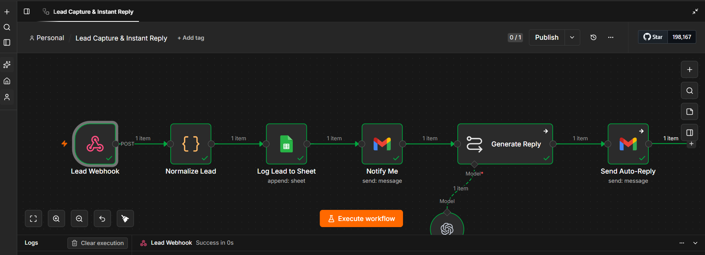

# Auto-Reply Lead Capture Automation

An n8n workflow that instantly replies to new leads using AI, logs 
them automatically, and eliminates delayed response times.

## The Problem

Most businesses take hours to respond to new leads from forms or 
messages. By the time they reply, the lead has often gone cold or 
contacted a competitor.

## The Solution

This workflow captures a lead the moment they submit a form, generates 
a personalized AI reply within seconds, sends it automatically, and 
logs everything — with zero manual work.

## Workflow Diagram

## How It Works

1. **Lead Webhook** — receives lead data (name, email, message) via POST
2. **Normalize Lead** — cleans and structures the incoming data
3. **Log Lead to Sheet** — saves lead details to Google Sheets for tracking
4. **Notify Me** — sends an internal notification that a new lead came in
5. **Generate Reply** — an AI model (Groq/Llama 3.3) reads the lead's 
   message and writes a warm, personalized response
6. **Send Auto-Reply** — delivers the AI-generated reply back to the 
   lead automatically

## Tech Stack

- **n8n** — workflow automation
- **Groq (Llama 3.3 70B)** — AI reply generation
- **Google Sheets** — lead logging
- **Webhook** — trigger

## Result

Response time reduced from hours to under a minute — no leads missed, 
no manual follow-up needed.

## Status

Demo project built to showcase automation capability for AI agency 
services. Available for custom implementation for businesses.

## Setup

1. Import `workflow.json` into your n8n instance
2. Connect your webhook source (form/CRM)
3. Add your Groq API key (base URL: `https://api.groq.com/openai/v1`)
4. Connect Google Sheets credentials
5. Publish/activate the workflow

---

Built by Husnain — AI Agency Developer  
https://www.linkedin.com/in/muhammad-husnain-fareed/ | nainotech-solutions.lovable.app
